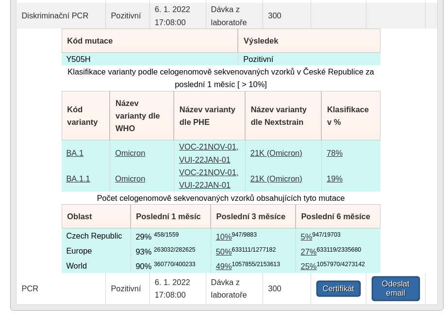

# PRO OC Mutation tracker

[Rozšíření do Mozilla Firefox](https://addons.mozilla.org/addon/pro-oc-mutation-tracker/)

Rozšíření přidává do modulu [Pacienti COVID-19](https://ereg.ksrzis.cz/Registr/CUDZadanky/VyhledaniPacienta) rozšířenost zjištěných mutací a % klasifikaci [WHO označení](https://www.who.int/en/activities/tracking-SARS-CoV-2-variants#PageContent_C238_Col01) varianty podle celogenomově sekvenovaných vzorků z testovaných mutací. V potaz se berou vyvrácené i potvrzené.

## Zásady ochrany osobních údajů

Osobní informace pacientů podmíněné přihlášením do modulu [Pacienti COVID-19](https://ereg.ksrzis.cz/Registr/CUDZadanky/VyhledaniPacienta) a webové aplikace [Žádanky testů COVID-19](https://eregpublicsecure.ksrzis.cz/Registr/CUD/Overeni) jsou použity pouze pro zobrazení více informací o mutacích. **Žádná data nejsou jakkoliv jinak zpracovávána ani přeposílána.**

## Pacienti COVID-19

- Zobrazuje podíl vzorků obsahujících stejné mutace z celkového počtu celogenomově sekvenovaných vzorků v České Republice, Evropě a na celém světě za 1, 3 a 6 posledních měsíců.
- Klasifikuje pacientův nález (zjištěné mutace) podle celogenomově sekvenovaných vzorků obsahujících stejné mutace do označeních podle [WHO](https://www.who.int/en/activities/tracking-SARS-CoV-2-variants/). Data jsou použita pro Českou Republiku za poslední měsíc.

## Zdroj

- [https://open.cov-spectrum.org/](https://open.cov-spectrum.org/)

## Použité knihovny

- [jQuery 3.6.0](https://code.jquery.com/jquery-3.6.0.min.js)
- [d3 v7](https://d3js.org/d3.v7.min.js)